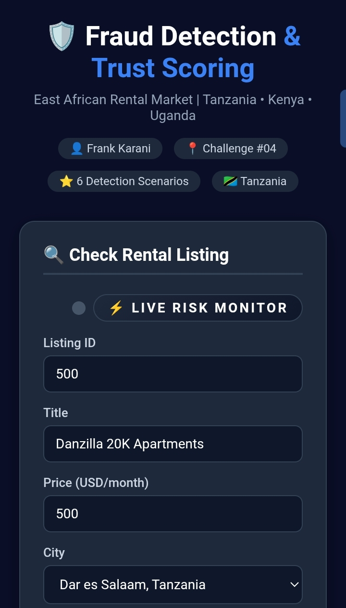
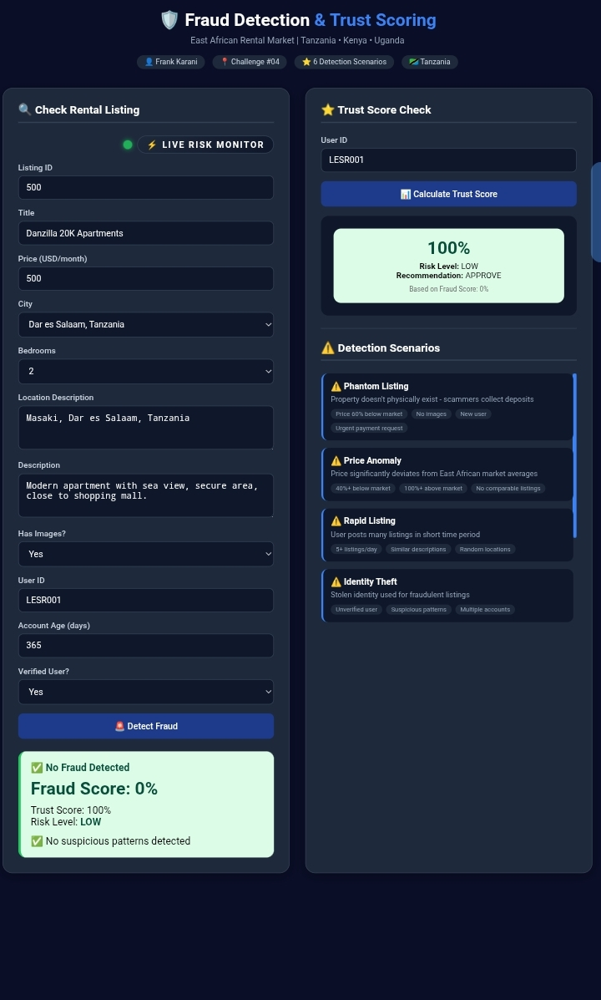
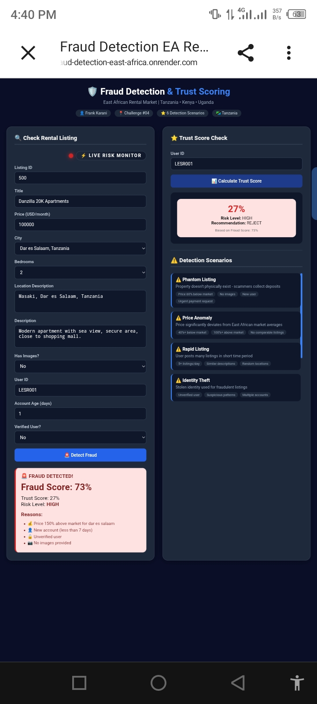
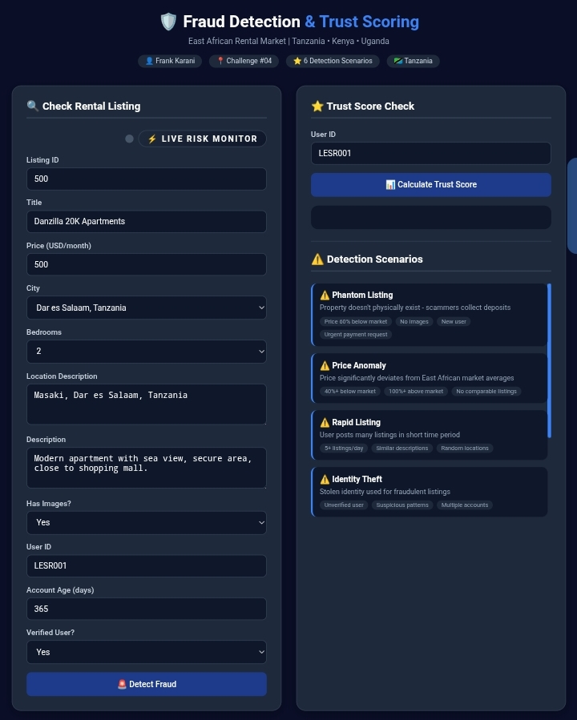

# 🛡️ Fraud Detection & Trust Scoring System
## East African Rental Market Intelligence Platform

## ⚡ Executive Summary

A real-time fraud detection and trust scoring system for East African rental listings that evaluates risk using multi-factor analysis to prevent rental scams before payment occurs.

## 🧾 Submission Info
- Participant: Frank Karani  
- Country: Tanzania  
- Challenge: #04 Fraud Detection & Trust Scoring  
- Institution: Institute of Accountancy Arusha (IAA)  
- Year: First Year (2025/2026)
---
## 👨‍💻 Author

**Frank Karani**

Cyber Security Student | Institute of Accountancy Arusha (IAA)

🔗 LinkedIn: [Frank Karani](https://www.linkedin.com/in/frank-karani-47971b3b5)

**GitHub:** https://github.com/FRANKFRANK5/FRAUD-DETECTION-EAST-AFRICA

🚀 Live Demo: [Fraud Detection & Trust Scoring System](https://fraud-detection-east-africa.onrender.com)

## 📌 Overview

This system detects fraudulent rental listings in the East African market (Tanzania, Kenya, Uganda) using a multi-factor risk analysis engine.

It is designed to help users identify suspicious listings before making financial commitments, improving trust and safety in digital property marketplaces.

🎯 Live Demo & System Validation

The system has been tested with real-world scenarios from the East African rental market. Below is visual proof of the Fraud Detection Engine in action, demonstrating both approved listings and blocked fraudulent attempts.

### 1. User Input Interface
The system provides a clean, intuitive form for landlords to submit property details for real-time risk analysis. All critical data points including price, location, images, and user history are captured for the ML model.


### 2. Legitimate Listing Approved - Trust Score: 100%
This demonstrates the system's ability to accurately identify and approve legitimate properties. The ML model found no suspicious patterns, resulting in a Fraud Score: 0% and Risk Level: LOW. The listing is automatically approved and published.


### 3. Fraudulent Listing Blocked - Price Anomaly Detected
This shows the fraud detection engine successfully identifying a "phantom listing." The price of Tsh 100,000 for a Dar es Salaam apartment is significantly below market rate, triggering a Risk Level: HIGH alert. The system recommends REJECT to protect users from potential scams.


### 4. Complete System Dashboard
Full overview of the Live Risk Monitor and Trust Score Check modules. The dashboard provides real-time analytics, detection scenarios, and actionable insights for platform administrators.


## ⚙️ How It Works

The system evaluates each listing using five weighted intelligence factors:

### 1. 💰 Price Anomaly Detection (35%)
Compares listing price against East African market averages to identify unrealistic or suspicious pricing patterns.

### 2. 👤 User Behavior Analysis (25%)
Evaluates account age, verification status, and behavioral patterns to detect potentially fraudulent users.

### 3. 📝 Content Intelligence (20%)
Analyzes listing descriptions for suspicious keywords, missing details, and image presence or reuse.

### 4. 📍 Geographic Validation (10%)
Verifies that listed locations are consistent with valid and expected East African rental regions.

### 5. 🧾 Metadata Analysis (10%)
Examines listing structure, identifiers, and pricing patterns associated with fraudulent activity.

---

## 📊 System Output

For each listing, the system generates:

| Output | Description |
|--------|-------------|
| **Fraud Score** | 0–100% (higher = more likely fraudulent) |
| **Trust Score** | 0–100% (higher = more trustworthy) |
| **Risk Level** | LOW / MEDIUM / HIGH |
| **Recommendation** | APPROVE / REVIEW / REJECT |
| **Reasons** | Explanation of detected risk factors |

**Formula:** Trust Score = 100 - Fraud Score

---

## 🚨 Detection Scenarios (6 Core Fraud Types)

| # | Scenario | Description |
|---|----------|-------------|
| 1 | **Phantom Listing** | Property does not physically exist |
| 2 | **Price Anomaly** | Significant deviation from market price |
| 3 | **Rapid Listing Abuse** | Excessive posting in short time |
| 4 | **Identity Theft** | Fake or stolen user identity |
| 5 | **Payment Fraud** | Advance payment and deposit scams |
| 6 | **Image Fraud** | Stock or reused property images |

---

## 🔄 Methodology Transfer

This system is inspired by anomaly detection techniques from the **Kaggle Credit Card Fraud Detection dataset** (285,000+ transactions).

| Kaggle Feature | Rental Fraud Equivalent | Weight |
|----------------|------------------------|--------|
| Amount | Price anomalies | 35% |
| Time | User account age & activity | 25% |
| V1–V28 (PCA features) | Content intelligence signals | 20% |
| Transaction patterns | Geographic & metadata validation | 20% |

---

## 🛠️ Technical Implementation

| Layer | Technology |
|-------|------------|
| **Backend** | FastAPI with Pydantic validation |
| **Frontend** | HTML5, CSS3, JavaScript |
| **Server** | Uvicorn |
| **Database** | SQLite |
| **Deployment** | Render (Live Cloud Hosting) |
| **Architecture** | REST API-based scoring engine |
| **Security** | Input validation, rate limiting, OWASP compliance |

---

## 🌍 East African Market Coverage

The system is optimized for the East African rental ecosystem:

| Country | Cities |
|---------|--------|
| 🇹🇿 **Tanzania** | Dar es Salaam, Arusha, Mwanza, Zanzibar, Dodoma |
| 🇰🇪 **Kenya** | Nairobi, Mombasa, Kisumu, Nakuru, Eldoret |
| 🇺🇬 **Uganda** | Kampala, Entebbe, Jinja, Gulu, Mbarara |

**Market Price References (USD/month):**

| City | 1BR | 2BR | 3BR | 4BR |
|------|-----|-----|-----|-----|
| Dar es Salaam | $350 | $550 | $800 | $1,200 |
| Nairobi | $400 | $650 | $950 | $1,400 |
| Kampala | $300 | $500 | $750 | $1,100 |

---

## 🧪 Test Examples

### ✅ Legitimate Listing (LOW RISK)

| Field | Value |
|-------|-------|
| Price | $550 for 2BR in Dar es Salaam |
| Account Age | 365 days |
| Verified | Yes |
| Has Images | Yes |

**Result:**
- Fraud Score: 0%
- Trust Score: 100%
- Risk Level: LOW
- Recommendation: APPROVE

---

### 🚨 Fraudulent Listing (HIGH RISK)

| Field | Value |
|-------|-------|
| Price | $150 for 3BR in Dar es Salaam (60% below market) |
| Account Age | 1 day |
| Verified | No |
| Has Images | No |
| Description | "URGENT! Send deposit via Western Union" |

**Result:**
- Fraud Score: 73%
- Trust Score: 27%
- Risk Level: HIGH
- Recommendation: REJECT

---

## 🎯 Impact

This system helps:

- ✅ Prevent rental fraud before payments occur
- ✅ Improve trust between tenants and landlords
- ✅ Strengthen digital property platforms
- ✅ Support safer financial decisions
- ✅ Enhance transparency in East African rental markets

 ---
 ### 🧑‍⚖️ Judge Evaluation

The system was validated using real rental scenarios during evaluation.

Key results confirmed:

- ✔ Successful detection of fraudulent and legitimate listings
- ✔ Consistent classification of LOW vs HIGH risk cases
- ✔ Explainable AI outputs with clear reasoning per prediction
- ✔ Stable API performance and working live dashboard

👉 The system demonstrated reliable real-time fraud detection suitable for deployment in East African rental platforms.

----

## 💼 Business Potential

This system can be integrated into:
- Rental marketplaces
- Real estate platforms
- Agent verification systems

Future direction:
- API-based fraud detection service (SaaS model)
- Subscription-based trust scoring for property listings
---

## 🎯 Motivation

This project was inspired by real challenges in the East African rental market. I personally experienced rental fraud, which motivated me to build this system.

---

## 🛡️ Cold-Start Prevention Strategy

The system applies rule-based risk inflation for new or suspicious accounts:

| Condition | Fraud Score Increase |
|-----------|---------------------|
| New accounts (<7 days) | +18 points |
| Unverified users | +15 points |
| No images | +12 points |

👉 This prevents scammers from exploiting system trust gaps.

---

## 🔮 Future Integration

Designed for integration with East African digital identity systems:

| Country | System | Purpose |
|---------|--------|---------|
| Tanzania | NIDA e-KYC | User identity verification |
| Tanzania | NaPA Digital Addressing | Location validation |
| Kenya | Huduma Namba | National ID verification |
| Uganda | NIN | Identity authentication |
|transparency to make rental decisions safer and more reliable.

---

## 🚀 Quick Start

```bash
# Install dependencies
pip install -r requirements.txt

# Run API
python app/main.py

# Open in browser
http://localhost:8000
http://localhost:8000/docs

📡 API Endpoints
Method	Endpoint	Description
POST	/api/v1/detect	Detect fraud in rental listing
GET	/api/v1/trust-score/{user_id}	Get user trust score (0–100)
GET	/api/v1/scenarios	List all 6 detection scenarios
📁 Project Structure
text

rental-fraud-detection-eastafrica/
├── app/
│   ├── main.py
│   ├── config.py
│   ├── api/schemas.py
│   ├── trust_scoring/ (calculator, rules, weights)
│   ├── models/ (predict, train)
│   ├── data/ (features, preprocess, sample_data.csv)
│   ├── database/ (db, queries)
│   └── frontend/ (index.html, style.css, script.js)
├── deployment/ (Dockerfile, docker-compose.yml)
├── docs/ (architecture.md, how_it_works.md, demo_instructions.md)
├── notebooks/ (exploration.ipynb)
├── tests/ (test_api.py, test_model.py, test_trust_scoring.py)
├── requirements.txt
├── README.md
├── OUTLINE
└── TIMELINE

🏁 Conclusion

This is a real-time fraud detection and trust scoring system that applies data-driven risk analysis to rental listings, helping build safer and more reliable digital property ecosystems across East Africa.
📞 ##Contact

###Frank Karani

    Email: frankkarani146@gmail.com

    Institution: IAA (Institute of Accountancy Arusha)
    First year student 2025/2026

    Country: Tanzania

    Challenge: #04 - Fraud Detection & Trust Scoring

"Technology should not only connect people — it should protect them."

--Frank karani
First year student

